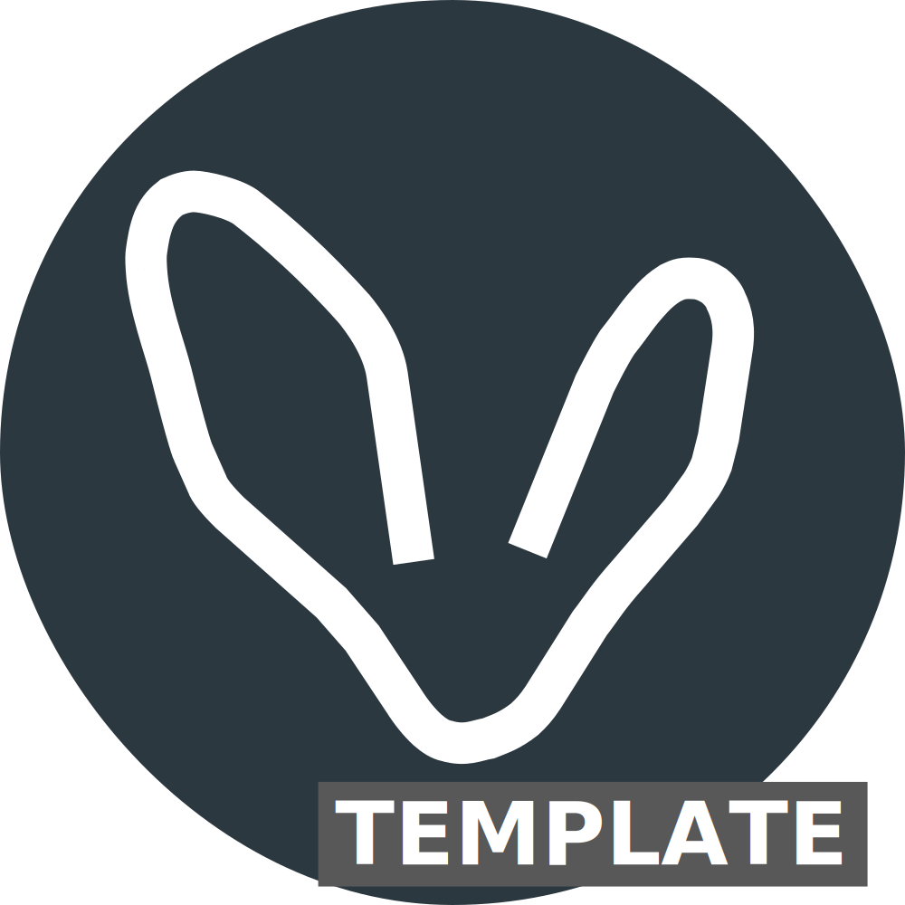

# Amadla Template

Amadla Framework repository contains documentation for the Amadla environment and is a foundation that you can use to build your own Amadla environment.

Amadla CLI is for commanding what is in your configuration files that will be found in a repository that is based on the Amadla Framework repository.

You can use this repository to start or someone else's.

When it comes to the documentation what is found in this repository is a general documentation for the Amadla environment.

The documentation found in the [Amadla CLI](https://github.com/AmadlaOrg/amadla-cli) repository is a documentation for the Amadla CLI. It also covers some of the Amadla concepts but the documentation found here goes into more details.

## :books: Documentations
- :card_index_dividers: [html](https://amadla.org/amadla-template/docs/latest/html/en/)
- :briefcase: [pdf](https://amadla.org/amadla-template/docs/latest/pdf/en/)
- :green_book: [epub](https://amadla.org/amadla-template/docs/latest/epub/en/)
- :memo: [wiki](https://github.com/AmadlaOrg/amadla-template/wiki)
- :open_book: [readthedocs](https://amadla-template.readthedocs.io/en/latest/)

### :fleur_de_lis: Why is the documentation also in French?

Our *127.0.0.1* is in Québec :fleur_de_lis:, Canada 🇨🇦 for this reason we have to provide our [documentation in French](./README.fr.md).

## :scroll: Copyright and License
- The license for the code can be found in the [LICENSE](./LICENSE) file.

---

Made in Québec :fleur_de_lis:, Canada 🇨🇦!
